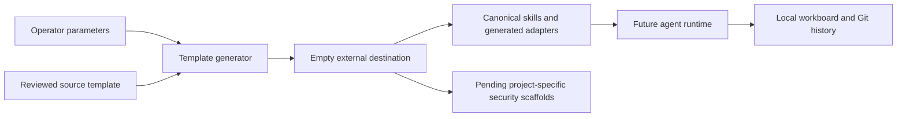

# portable-agent-repository-kit detailed threat-model baseline

## Status and scope

Source baseline: `bfc41923fb497b495e95dc7dee644313b51b368b`. Adoption: 2026-10-08.
Status: source-based initial model; independent human security review pending.
This model contains attack hypotheses, not validated vulnerability findings.
Existing canonical security documentation and stricter acceptance gates remain
applicable. Future changes must update this baseline rather than treating its
source revision as evidence for newer behavior.

PARK copies and configures a repository template, synchronizes agent adapters and provides validation/workboard workflows. Generated projects have their own architecture and must not inherit PARK-specific threat conclusions. Template generation does not deploy or establish runtime security.

## Assets, actors and assumptions

Assets: User destination files; source template and instruction integrity; private local config/audit reports; project identity/license metadata; generated skills and CI; workboard state and Git history.

Actors: Template consumer; malicious template/skill contributor; local actor changing filesystem paths; compromised copied dependency or action; agent misinterpreting generated guidance.

Assume an authorized operator, a trusted host and reviewed checkout. Treat input,
remote responses and imported content as untrusted. Repository access or a local
host administrator can bypass controls inside that same authority domain. Live
IAM, network controls, secret backend behavior and release protection require
operating evidence; they are not inferred from configuration files. Credentials,
private payloads and real identifiers must never be copied into this document.

## Components, data flows and trust boundaries

| Flow | Boundary and effective authority |
| --- | --- |
| Source template → copy → destination | Source content becomes a new trusted development surface; destination must be empty and outside source. |
| Project parameters → token rendering / license → generated repository | Identity substitution affects documents and executable/configuration text. |
| Canonical skills → Claude/other adapters → agent runtime | Copied instructions are capabilities, not merely prose. |
| Generated repo → future project code / deployment | The future project owner must replace pending architecture and review scope with evidence. |

The flow table defines the project-specific boundaries behind this overview.
Authentication of an upstream service does not make its content trusted. Review
the effective filesystem path, subprocess arguments, network recipient, cloud
account and credential recipient rather than only their user-supplied labels.

## Implementation evidence inventory

- `scripts/_template_common.py`: inspect at the baseline revision; evidence scope is limited to this component.
- `scripts/create_project.py`: inspect at the baseline revision; evidence scope is limited to this component.
- `scripts/agent/sync_adapters.py`: inspect at the baseline revision; evidence scope is limited to this component.
- `tests/test_template.py`: inspect at the baseline revision; evidence scope is limited to this component.
- `docs/SECURITY_MODEL.md`: inspect at the baseline revision; evidence scope is limited to this component.

## Threat register and prioritization

Impact High means private-data/credential exposure, authority escalation, material
integrity loss or substantial operational harm. Medium means bounded disclosure,
misleading results or recoverable disruption. Likelihood Medium means an exposed
or routinely supplied input could reach the boundary; Low needs stronger local
access or multiple prerequisites. P1 requires review/remediation or explicit human
risk acceptance before the affected capability is released; P2 requires scheduled
hardening and validation before expanding exposure. These are qualitative planning
priorities, not CVSS scores or proof of exploitability.

For every entry below, the human accountable owner is **maintainer/security
reviewer, assignment pending**. Triage within 30 days of adoption; complete P1
validation before the affected release/capability expansion and schedule P2 within
90 days. Existing controls do not close the hypothesis without validation.

### T01: Destination overwrite

- Attack path / prerequisite: Generation destroys existing user work or recursively copies source into itself.
- Inherent impact: High; likelihood: Low; priority: P2.
- Existing evidence / limitation: _template_common.py rejects nonempty destinations and destinations inside source.
- Proposed mitigation and validation: Run destination preservation and recursive-path regression tests; consider concurrent filesystem mutation outside current guarantee.
- Residual risk / status: unverified; human review and evidence pending. Retain
  this entry until a reviewer records outcome, exact revision and remaining risk.

### T02: Private-file propagation

- Attack path / prerequisite: Local configuration or audit output is copied into a public generated project.
- Inherent impact: High; likelihood: Medium; priority: P1.
- Existing evidence / limitation: Copy/synchronization excludes *.local.json and churn-v* reports plus known runtime files.
- Proposed mitigation and validation: Regression-test private sentinels across copy and adapters; review new private artifact patterns and symlink behavior.
- Residual risk / status: unverified; human review and evidence pending. Retain
  this entry until a reviewer records outcome, exact revision and remaining risk.

### T03: Canonical instruction compromise

- Attack path / prerequisite: Malicious template/skill changes grant agents dangerous capabilities in every generated project.
- Inherent impact: High; likelihood: Medium; priority: P1.
- Existing evidence / limitation: Adapter drift checks demonstrate consistency only; synchronized malicious instructions remain malicious.
- Proposed mitigation and validation: Require independent human review of canonical instructions, CI and generator; inspect effective permissions in generated output.
- Residual risk / status: unverified; human review and evidence pending. Retain
  this entry until a reviewer records outcome, exact revision and remaining risk.

### T04: Template-model inheritance

- Attack path / prerequisite: A generated app claims PARK-specific controls or retroactive human review.
- Inherent impact: High; likelihood: Medium; priority: P1.
- Existing evidence / limitation: This change introduces project-specific pending model and review scaffolds during configuration.
- Proposed mitigation and validation: Regression-test replacement of source model and coverage; require architecture inventory before first behavior change/release.
- Residual risk / status: unverified; human review and evidence pending. Retain
  this entry until a reviewer records outcome, exact revision and remaining risk.

### T05: Parameter/rendering confusion

- Attack path / prerequisite: Project identity substitutions unintentionally alter executable text or unsafe paths.
- Inherent impact: Medium; likelihood: Medium; priority: P2.
- Existing evidence / limitation: Slug, owner and default-branch validation exists; token replacement visits text files.
- Proposed mitigation and validation: Test invalid inputs and generated contract; review new token-bearing executable formats before adding them.
- Residual risk / status: unverified; human review and evidence pending. Retain
  this entry until a reviewer records outcome, exact revision and remaining risk.

### T06: Dependency/release compromise

- Attack path / prerequisite: Copied workflow or dependency fetch executes untrusted supply-chain content.
- Inherent impact: High; likelihood: Medium; priority: P1.
- Existing evidence / limitation: Local contract and adapter checks exist; they are not a provenance proof.
- Proposed mitigation and validation: Inventory actions and downloaded tools; pin/review sources, restrict token permissions and verify release provenance.
- Residual risk / status: unverified; human review and evidence pending. Retain
  this entry until a reviewer records outcome, exact revision and remaining risk.

### T07: Build or dependency compromise

- Attack path / prerequisite: A compromised dependency, image or workflow obtains developer or release authority.
- Inherent impact: High; likelihood: Medium; priority: P1.
- Existing evidence / limitation: Repository validation is evidence of local checks, not proof of dependency provenance or hosted policy.
- Proposed mitigation and validation: Inventory and pin applicable dependencies/actions/images; review changes, scan known issues and verify exact release artifact provenance.
- Residual risk / status: unverified; human review and evidence pending. Retain
  this entry until a reviewer records outcome, exact revision and remaining risk.

### T08: Incident recovery failure

- Attack path / prerequisite: Credentials, data or service availability cannot be recovered after compromise or accidental change.
- Inherent impact: High; likelihood: Low; priority: P2.
- Existing evidence / limitation: Operational checkpoints preserve code history; data and credential recovery require separate procedures.
- Proposed mitigation and validation: Human owner must document detection signals, restricted incident evidence, credential revocation, backups and a disposable restore exercise.
- Residual risk / status: unverified; human review and evidence pending. Retain
  this entry until a reviewer records outcome, exact revision and remaining risk.

## STRIDE and privacy coverage

| Category | Review obligation |
| --- | --- |
| Spoofing | Verify user/service/endpoint identity and binding to effective resource; reject stale/replayed authorization. |
| Tampering | Protect source, state, imported records and generated artifacts; test races and malformed input. |
| Repudiation | Record bounded, redacted action and review evidence with revision and actor; protect audit access. |
| Information disclosure | Trace secrets/private data through storage, logs, exports, backups and external recipients. |
| Denial of service | Bound input size, concurrency, retries and time; test dependency failure and recovery. |
| Elevation of privilege | Inventory tool/subprocess, filesystem, cloud and release privileges; deny unauthorized capability expansion. |
| Privacy | Confirm purpose, consent, minimization, retention/deletion and provider handling before real private data use. |

These obligations apply to each flow above. A component without a given surface
must record why the control is inapplicable; absence of evidence is not a pass.

## Security operations and open questions

Before real deployment or expanded capability, assign named human owners and
confirm effective identity/IAM, endpoint and network exposure, secret storage and
rotation, private-data lifecycle, dependency provenance, release authority and
resource limits. Record deployment/version-specific evidence and unresolved gaps.
Define redacted detection signals for rejected authorization, unexpected endpoint
changes, repeated parse failures and resource exhaustion where applicable. Keep
incident evidence access restricted. Document credential revocation, containment,
recovery owner, backups and restore validation; do not execute live destructive
or paid operations without their existing authorization.

Validate threats with synthetic negative tests and bounded local fixtures first;
use authorized integration/live checks only where needed and identify their
actual operating scope. A passing static/local test does not establish hosted,
packaged, cloud or physical-device assurance. Security findings discovered during
validation need reproducible evidence and separate tracked remediation.

## Maintenance and human acceptance

Update this model alongside changes to any listed asset, flow, recipient,
permission, parser, dependency, build or deployment assumption. Review at each
release and quarterly; record next review date when a human accepts the baseline.
Use [Engineering review policy](ENGINEERING_REVIEW.md) for reference frameworks,
checkpoint commits and exact-revision approval, and
[Review coverage](security/REVIEW_COVERAGE.md) for the outstanding retroactive
inventory. Human reviewer/date/accepted revision: **pending**. No residual risk is
accepted by this initial document.
